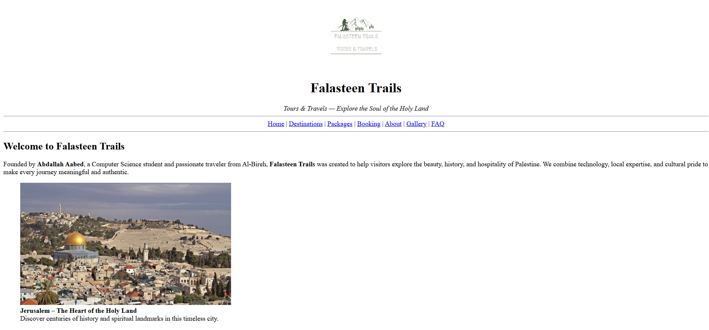
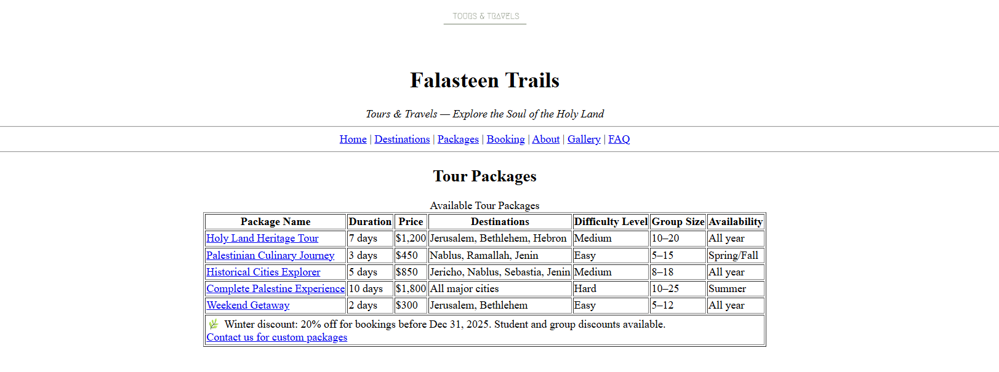

# Assignment 1 – Semantic Foundation: Falasteen Trails

## 📖 Overview
This is the **initial phase** of the Falasteen Trails project.  
The focus of this assignment was to build a **solid structural foundation** using **Semantic HTML5**.  
At this stage, the site is **static**, designed to demonstrate **document hierarchy** and the proper use of HTML elements before adding styling or server-side logic.

---

## 🎯 Learning Objectives
- Implement HTML5 Semantic Tags: `<header>`, `<main>`, `<section>`, `<footer>`.  
- Structure complex data using **Nested Lists** and **Definition Lists**.  
- Utilize **Tables** to present structured data (e.g., Trip Pricing).  
- Implement **Form Elements** for user inquiries.  
- Create **internal navigation** using anchors.

---

## 🏗️ Key HTML Components
- **Semantic Layout:** `<article>` and `<aside>` differentiate main travel story from sidebar info.  
- **Navigation:** Structured `<nav>` menu for easy access to sections.  
- **Data Presentation:** `<table>` displays trip durations, difficulty levels, and pricing clearly.  
- **Interactive Elements:** `
` and `
` for FAQ / Itinerary toggling.

---

## 📸 Screenshots
1. **Document Structure**

2. **Information Architecture**
`

---

## 🛠️ Requirements to View
- No server required.  
- Open `index.html` in any modern web browser (Chrome, Firefox, Edge).

---

## 🔗 Links
- [Return to Main Repo](../README.md)  
- [View Assignment 1 Live](index.html)
