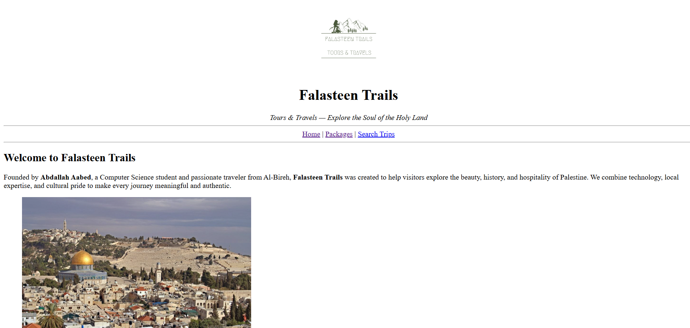
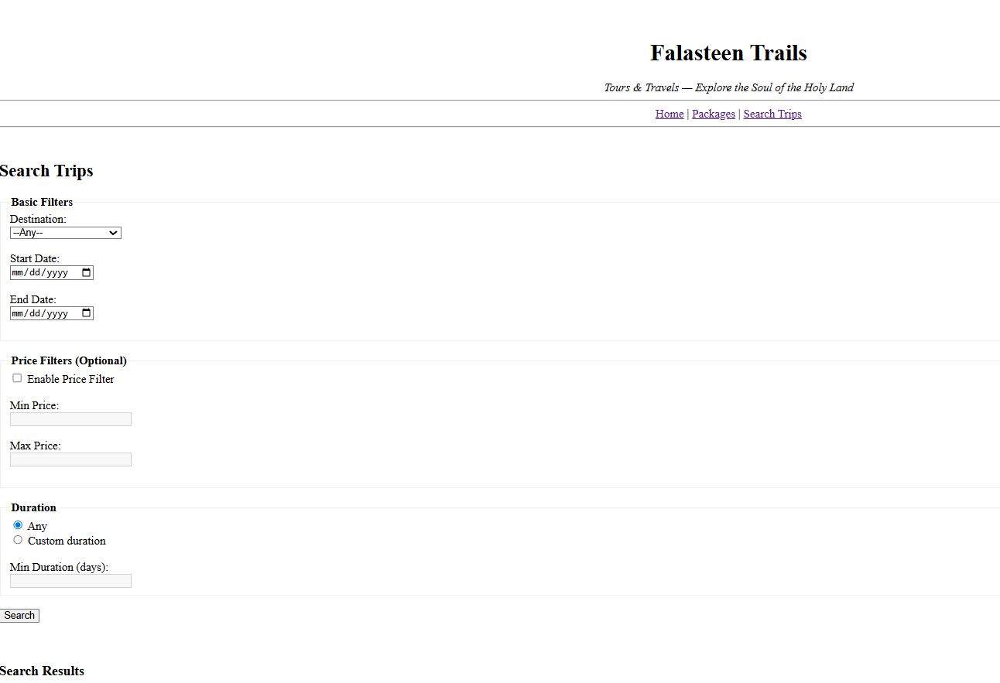
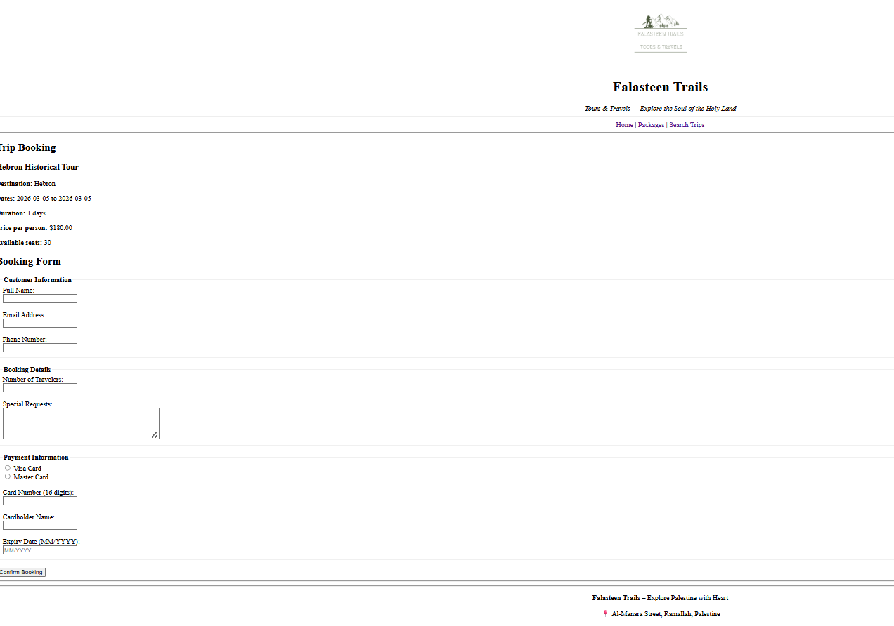

# Falasteen Trails – Trip Booking System

An interactive **PHP & MySQL-based web application** designed to help travelers explore the Holy Land.  
Users can browse tour packages, filter trips, view detailed itineraries, and make bookings through a simulated secure booking gateway.

---

## 🚀 Features

- **Dynamic Trip Catalog:** Fetches live data from MySQL to display tours, pricing, and seat availability.  
- **Advanced Search Engine:** Filter trips by destination, date range, price, and duration.  
- **Interactive Trip Details:** Organizes itineraries using `<details>` and `<summary>` for clean presentation.  
- **Robust Booking Process:**  
  - Validates customer inputs (Email, Phone, Card format).  
  - Checks seat availability in real-time.  
  - Updates available seats automatically upon successful booking.  
  - Generates unique Booking IDs and calculates total prices.  
- **Secure Database Handling:** Uses **PDO with Prepared Statements** to prevent SQL Injection.

---

## 🛠️ Technology Stack

- **Frontend:** HTML5, CSS3  
- **Backend:** PHP 8.x  
- **Database:** MySQL  
- **Connection Method:** PDO (PHP Data Objects)  

---

## 📂 Project Structure

```

ass2/
├── db_config.php          # Database connection settings
├── index.php              # Welcome page & company news
├── tour-packages.php      # Overview of all available tours
├── search-trips.php       # Trip filtering & search interface
├── trip-details.php       # Detailed view of a single trip
├── booking.php            # Customer checkout/reservation form
├── process-booking.php    # Handles data validation, booking, and DB updates
├── header.php             # Reusable header component
├── footer.php             # Reusable footer component
├── css/                   # Styling files
└── images/               

```

---

## 📋 Prerequisites

1. A local server environment: **XAMPP**, **WAMP**, or **MAMP**.  
2. MySQL database named: `travel_company`.  
3. Required tables: `trips` and `bookings`.  

> Import the provided `travel_company.sql` to initialize the database.

---

---

## 🗄️ Database Setup
1. Open **phpMyAdmin**.
2. Create a new database named `travel_company`.
3. Import the `database.sql` file located in the `ass2/` folder.
4. Ensure your `db_config.php` matches your local MySQL credentials


---

## ⚙️ How to Run Locally

1. Copy the `ass2/` folder into your local server’s root directory (e.g., `htdocs` for XAMPP).  
2. Start Apache and MySQL services via your local server control panel.  
3. Ensure database credentials in `db_config.php` match your local MySQL setup.  
4. Open your browser and go to:  
```

[http://localhost/ass2/index.php](http://localhost/ass2/index.php)

```
5. Navigate the site: search trips, view details, and simulate bookings.

---

## 📸 Screenshots

### 1. Homepage / Trip Catalog


### 2. Search & Filter Interface


### 3. Booking Form & Confirmation
`  

---

## 🧠 Notes

- All PHP pages require a **server environment**; they will not run by opening directly in a browser.  
- Ensure your database is running and credentials are correct.  

---

## 👤 Author

**Abdallah Aabed**  
Computer Science Student at Birzeit University  
📧 [abdallahaabed211@gmail.com](mailto:abdallahaabed211@gmail.com)


